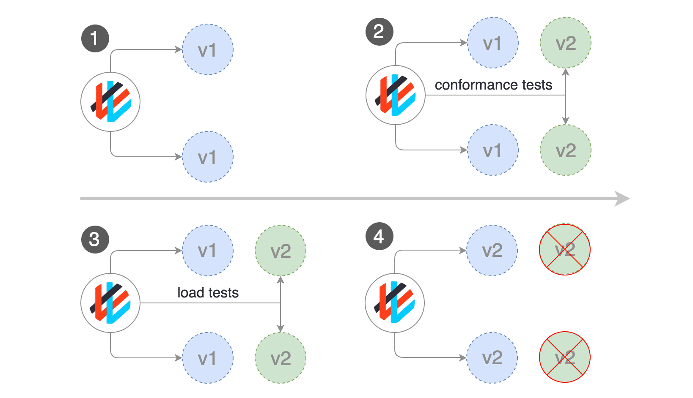

# Blue/Green Deployment Strategy

Blue-green deployment is an application release model that gradually transfers user traffic from a previous version of an app or microservice to a nearly identical new release—both of which are running in production.  

The old version can be called the blue environment while the new version can be known as the green environment. Once production traffic is fully transferred from blue to green, blue can standby in case of rollback or pulled from production and updated to become the template upon which the next update is made.  

There are downsides to this continuous deployment model. Not all environments have the same uptime requirements or the resources to properly perform CI/CD processes as blue-green. But many apps evolve to support such continuous delivery as the enterprises supporting them digitally transform.  



__Pros of Blue/Green Deployment-__  

1.	Allows for testing in live production.  
2.	Allows for minimal or zero downtime deployment.  

__Cons of Blue/Green Deployment-__  

1.	Increasingly more difficult at scale.  
2.	Not easily implemented if the new deployment is database dependent.  

Go inside the wordpress-mysql folder and Run the following commands to perform the strategy in master node or in the Windows if it is configured as a client  

```
$ kubectl apply -k .    # Deploying Word Press version 4.8 with MySQL 
$ kubectl apply -f wordpress-v5.yaml   # Deploying Word Press version 5.4.2 with MySQL
$ kubectl get po --show-labels -w  
$ kubectl get all 
```
Run the Wordpress with master node IP with service port assigned on browser to connect with Word Press site 
```
$ kubectl describe service  wordpress   # Here you can see the service is running with Word Press version 4.8
$ kubectl patch service wordpress -p "{\"spec\":{\"selector\":{\"version\":\"v5.4.2\"}}}"  # Redirecting the service from version 4.8 to version 5.4.2  
$ kubectl describe service  wordpress   # Here you can see the service is running with Word Press version 5.4.2
$ kubectl delete deploy wordpress-v1    # Deleting the older version pods if the newer version is stable
$ kubectl get po --show-labels -w  
```
__Deleting the pods to shutdown the application:__  

```
$ kubectl delete -f wordpress-v5.yaml  
$ kubectl delete -k .  
```
