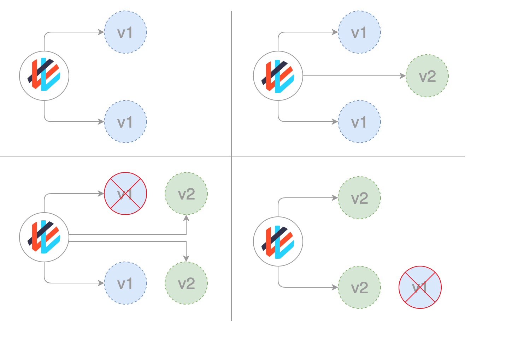

# Canary Deployment Strategy:  

Canary deployment strategy involves deploying new versions of application next to stable production versions to see how the canary version compares against the baseline before promoting or rejecting the deployment.  

In software development, the canary deployment strategy involves exposing new code in the production environment only to a small controlled group of users by rerouting a portion of traffic from the previous stable version of the software to the canary nodes. If everything works fine, all the traffic is rerouted to the canary version, effectively making it the new stable version. If some issues arise, the users are rerouted to the stable version and the canary nodes are rolled back to the previous code state.  



__Pros of Canary Deployment-__  

1.	Version released for a subset of users  
2.	Convenient for error rate and performance monitoring  
3.  Fast rollback  

__Cons of Canary Deployment-__  

1.	Slow rollout  
2.  Fine tuned traffic distribution can be expensive (99% A/ 1%B = 99 pod A, 1  pod B)  

Go inside the wordpress-mysql folder and Run the following commands to perform the strategy in master node or in the Windows if it is configured as a client
```
$ kubectl apply -k .    # Deploying Word Press version 4.8 with MySQL 
$ kubectl get po --show-labels -w  
$ kubectl get all 
```
Run the Wordpress with master node IP with service port assigned on browser to connect with Word Press site
```
$ kubectl describe service wordpress   # Here you can see the service is running with Word Press version 4.8
$ kubectl scale --replicas=1 deploy wordpress-v1  # Scaling down the pods of Word Press with version 4.8
$ kubectl apply -f wordpress-v5.yaml   # Deploying Word Press version 5.4.2 with MySQL
$ kubectl scale --replicas=2 deploy wordpress-v2  # Scaling up the pods of Word Press with version 5.4.2
$ kubectl get po --show-labels -w  
```

__Deleting the pods to shutdown the application:__
```  
$ kubectl delete -k .  
$ kubectl delete -f wordpress-v5.yaml
```
