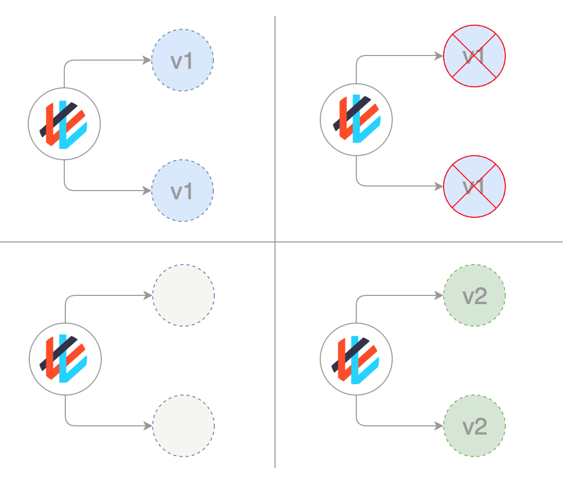

# Recreate Deployment Strategy:  

The recreate strategy is a dummy deployment which consists of shutting down version A then deploying version B after version A is turned off. This technique implies downtime of the service that depends on both shutdown and boot duration of the application.  

A deployment defined with a strategy of type Recreate will terminate all the running instances then recreate them with the newer version.  



__Pros of Recreate Deployment-__  

1.	Application state entirely renewed  

__Cons of Recreate Deployment-__  

1.	Downtime that depends on both shutdown and boot duration of the application  

Go inside the wordpress-mysql folder and Run the following commands to perform the strategy in master node or in the Windows if it is configured as a client  
```
$ kubectl apply -k .    # Deploying Word Press version 4.8 with MySQL 
$ kubectl get po --show-labels -w  
$ kubectl get all 
```

Run the Wordpress with master node IP with service port assigned on browser to connect with Word Press site
```
$ kubectl apply -f wordpress-v5.yaml   # Deploying Word Press version 5.4.2 with MySQL 
$ kubectl get po --show-labels -w      # While Containers are creating, users will face some seconds of downtime
$ kubectl get all 
```

__Deleting the pods to shutdown the application:__
```
$ kubectl delete -f wordpress-v5.yaml  
$ kubectl delete -k . 
```
