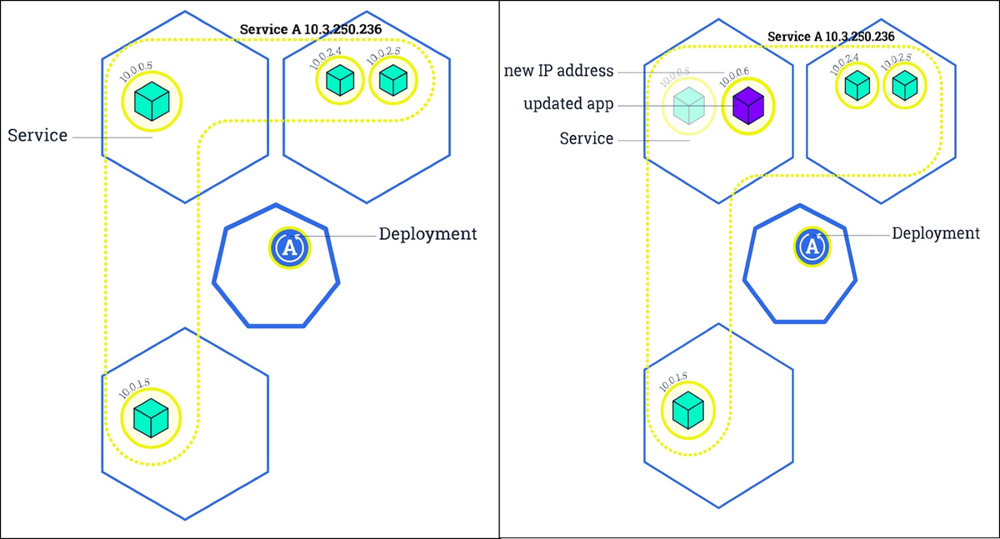

# Rolling Update Deployment Strategy:  

A rolling deployment is a software release strategy that staggers deployment across multiple phases, which usually include one or more servers performing one or more functions within a server cluster. Rather than updating all servers or tiers simultaneously, the organization installs the updated software package on one server or subset of servers at a time. A rolling deployment is used to reduce application downtime and unforeseen consequences or errors in software updates.  



__Pros of Rolling Deployment-__  

1.	Fault Tolerance: The aforementioned optional step of monitoring the new node greatly reduces the risks associated with potential bugs.  
2.	Rollback: During rolling deployment, you replace the nodes one by one, which can limit the number of users exposed to potential bugs. You can also roll the changes back very quickly because the old node does not get retired until the new node reaches a predefined acceptance criterion. Rolling back is as simple as reverting the traffic redirect.  
3.   Cost Reduction: Rolling deployment mitigates this issue because it requires just a single additional node. This caps the instantaneous system overhead during the entire deployment process to the overhead of just a single node.  

Go inside the wordpress-mysql folder and Run the following commands to perform the strategy in master node or in the Windows if it is configured as a client
```
$ kubectl apply -k .                       # Deploying Word Press version 4.8 with MySQL 
$ kubectl get po --show-labels -w  
$ kubectl get all
```

Run the Wordpress with master node IP with service port assigned on browser to connect with Word Press site
```
$ kubectl rollout status deploy wordpress  # Rolling out the deployment successfully
$ kubectl apply -f wordpress-v5.yaml       # Deploying Word Press version 5.4.2 with MySQL 
$ kubectl get po --show-labels -w      
$ kubectl get all 
$ kubectl rollout undo deploy wordpress    # If there is some bug in version 5.4.2 then the application can be rollout on previous version
$ kubectl get po --show-labels -w  
```
__Deleting the pods to shutdown the application:__
```
$ kubectl delete -f wordpress-v5.yaml  
$ kubectl delete -k . 
```
