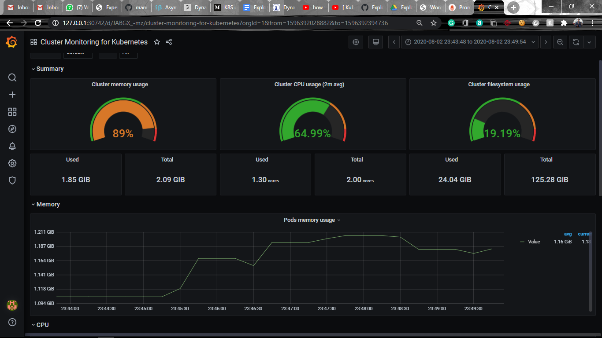

# Grafana Server:  

### Pre-requisites:  

Helm should be configured in your system.  

__Run the following commands to configure Grafana Server:__  

```
$ kubectl create namespace grafana
$ kubectl get sc
$ helm install stable/grafana --namespace grafana --set persistence.storageClassName="standard" --set adminPassword="redhat" --set service.type=LoadBalancer 
$ kubectl get svc -n grafana
$ kubectl -n grafana port-forward svc/<svc-name> <svc-port>:80
```  

- Run the IP which will be displayed after port forwarding.
- Login with admin account with password redhat which is mentioned in the command.  
- Select Data Source as Prometheus and write localhost as Prometheus Cluster IP.  
- Import dashboard of google as 10000.   


