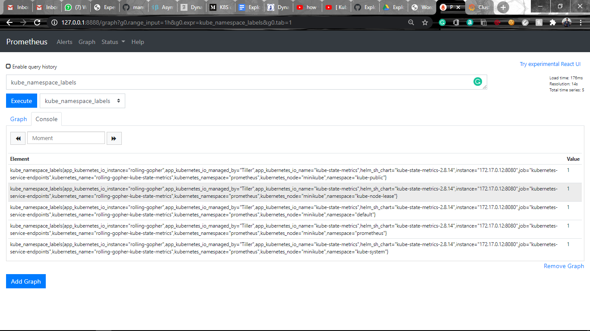

# Prometheus Server:

### Pre-requisites:  

Helm should be configured in your system.  

__Run the following commands to configure Pometheus Server:__  

```
$ kubectl create namespace prometheus
$ kubectl get sc
$ helm install stable/prometheus --namespace prometheus --set alertmanager.persistentVolume.StorageClass="standard" --set server.persistentVolume.storageClass="standard"
$ kubectl get svc -n prometheus
$ kubectl -n prometheus port-forward svc/<svc-name> 8888:80
```  

Run the IP which will be displayed after port forwarding.  


